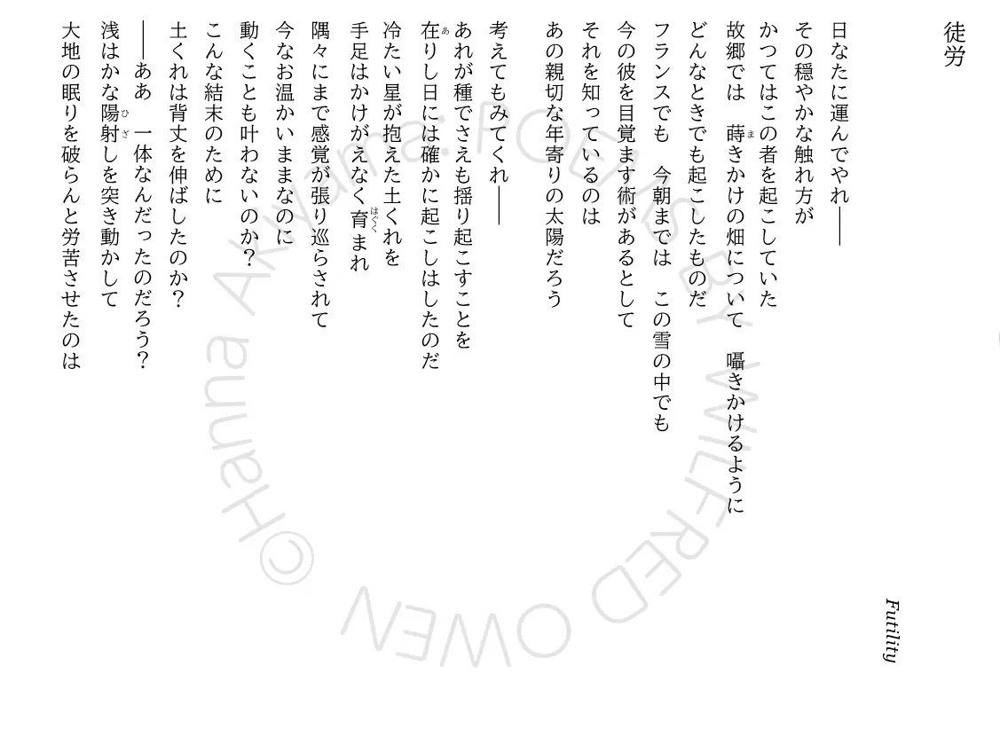
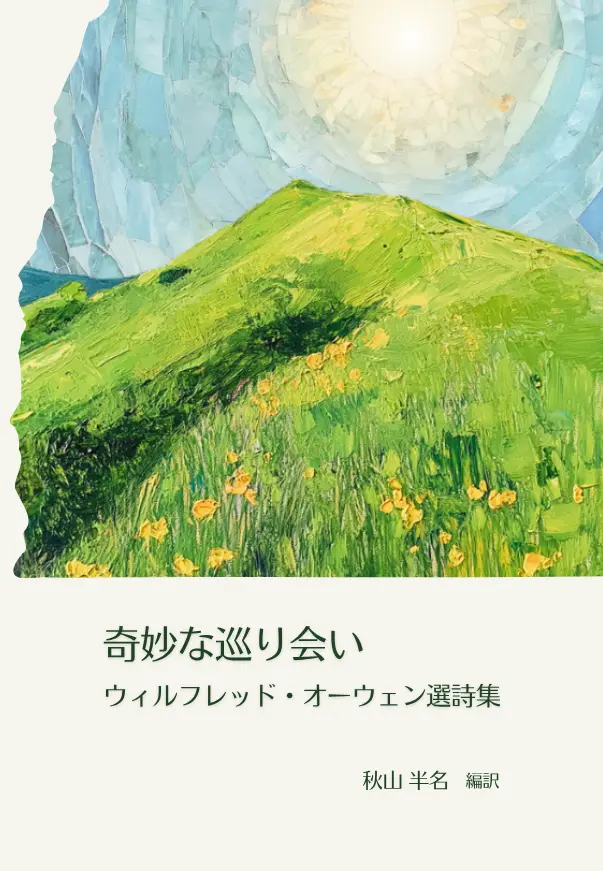

>[!information]　**2026/04/19** 📍[ZINE FEST 福岡](https://note.com/bookcultureclub/n/ndad992be0cf3)

>[!information]　**2026/05/04** 📍[文学フリマ東京42](https://c.bunfree.net/c/tokyo42/4F/%E3%81%88/40)

### Futility『徒労』

>※書籍は対訳ではありませんが、参考までに提示します

Move him into the sun—  
日なたに運んでやれ―

Gently its touch awoke him once,  
その穏やかな触れ方が  
かつてはこの者を起こしていた

At home, whispering of fields half-sown.  
故郷では　蒔(ま)きかけの畑について　囁きかけるように

Always it woke him, even in France,  
Until this morning and this snow.  
どんなときでも起こしたものだ  
フランスでも　今朝までは　この雪の中でも

If anything might rouse him now  
The kind old sun will know.  
今の彼を目覚ます術(すべ)があるとして  
それを知っているのは  
あの親切な年寄りの太陽だろう

Think how it wakes the seeds—  
考えてもみてくれ―  
あれが種でさえも揺り起こすことを

Woke once the clays of a cold star.  
在(あ)りし日には確かに起こしはしたのだ  
冷たい星が抱えた土くれを

Are limbs, so dear-achieved, are sides  
Full-nerved, still warm, too hard to stir?  
手足はかけがえなく育まれ  
隅々にまで感覚が張り巡らされて  
今なお温かいままなのに  
動くことも叶わないのか？

Was it for this the clay grew tall?  
こんな結末のために  
土くれは背丈を伸ばしたのか？

—O what made fatuous sunbeams toil  
To break earth's sleep at all?  
―ああ　一体なんだったのだろう？  
浅はかな陽射(ひざ)しを突き動かして  
大地の眠りを破らんと労苦させたのは

Original poems by Wilfred Owen (Public Domain).  
日本語訳：『奇妙な巡り会い ウィルフレッド・オーウェン選詩集』© 2026 by 秋山半名 is licensed under [CC BY-NC-ND 4.0](https://creativecommons.org/licenses/by-nc-nd/4.0/deed.ja)

---

### 📖**収録タイトル一覧**📖

・序文 [Preface]  
・出兵 [The Send-Off]  
・武器と少年 [Arms and the Boy]  
・亡ぶべき若人へ捧ぐ讃歌 [Anthem for Doomed Youth]  
・甘美にして名誉なり [Dulce et Decorum Est]  
・徒労 [Futility]  
・より大いなる愛 [Greater Love]  
・我が詩への弁明 [Apologia pro Poemate Meo]  
・奇妙な巡り会い [Strange Meeting]  
・見世物 [The Show]  
・使い潰された役立たず [The Dead-Beat]  
・歩哨 [The Sentry]  
・曝露 [Exposure]  
・自傷 [S. I. W]  
・無感性 [Insensibility]  
・春季攻勢 [Spring Offensive]  
・笑って 笑って もっと笑って [Smile, Smile, Smile]  
・精神病の症例 [Mental Cases]  
・不能 [Disabled]  
・大地に接して [A Terre]  
✒️我が翻訳への弁明 ――訳者あとがきに代えて  
✒️底本について  
✒️略年譜

